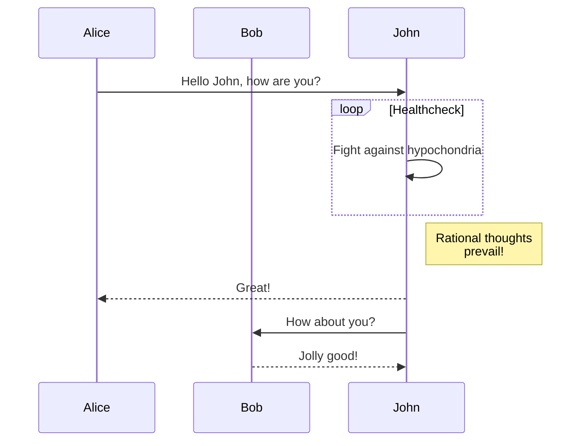

# Modular GitLab-CI

## Usage

A collection of stackable `.gitlab-ci.yml` templates for modular construction of GitLab-CI pipelines.

In many cases, including functionality is as easy as an include clause in a project's `.gitlab-ci.yml`. These templates are designed to be simple, intuitive, and as auto-magical as possible.

## Benefits

- [X] Reduced code repetition
- [X] Faster pipeline development and runs
- [X] Pipeline debugging options
- [X] Increased consistency among projects
- [X] Optimized performance
- [X] Pipelines can be altered and adapted quickly
- [X] Security (Vault Integration)

## Quickstart

Getting started guide [here](Getting_Started/quickstart.md).

## Detailed Guide

Check out more basic module examples [here](examples.md).

## Reference

Detailed usage descriptions [here](about/changelog.md).

